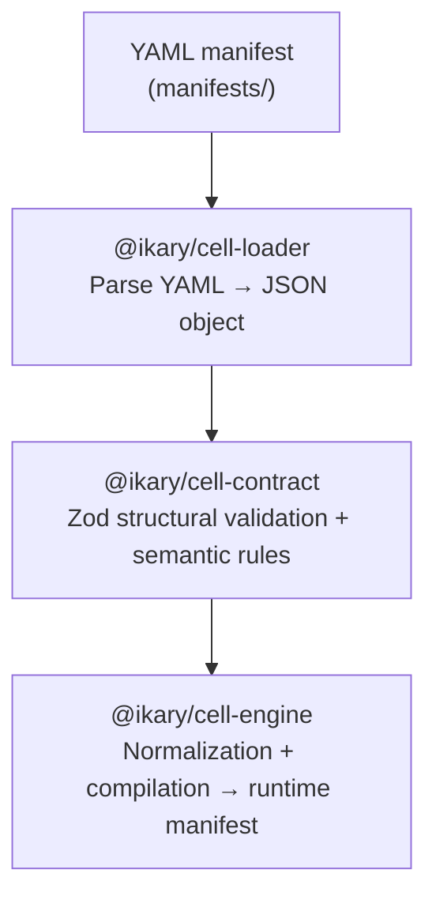
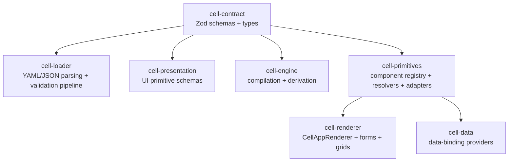

# Ikary Manifest

**AI should generate manifests, not code.**

Open-source declarative cell contracts, compilation engine, and multi-runtime renderer for the [Ikary Platform](https://ikary.co).

## What is IKARY?

IKARY is a declarative runtime. A contributor new to the repo only needs four terms:

- **Cell** — an isolated runtime environment that renders a presentation layer on top of the IKARY API. One Cell is one application: its own data, its own UI, its own lifecycle, described by a single manifest file.
- **Entity** — a domain object inside a Cell (for example `Customer`, `Invoice`). An entity declares fields, relations, computed values, capabilities (create/read/update/delete), and policies. The renderer generates list and detail pages for every entity from its definition.
- **Manifest** — the YAML or JSON file that defines a Cell. Its schema is `CellManifestV1`, published from [`@ikary/cell-contract`](./libs/cell-contract/). Loading, validating, and compiling a manifest turns it into a running Cell.
- **Primitive** — a reusable UI component (text input, date picker, table, chart). Built-in primitives ship in [`@ikary/cell-primitives`](./libs/cell-primitives/); projects register custom primitives via `ikary-primitives.yaml`.

Packages follow a naming convention so it is obvious what layer a module lives at:

- `cell-*` — Cell-domain code (contract schemas, engine, renderer, primitives, runtime).
- `system-*` — infrastructure that wraps a 3rd-party tool (Postgres via Kysely, react-intl, JWT, Pino, NestJS). Reusable outside the Cell domain.

See [`apps/docs/guide/repository-conventions.md`](./apps/docs/guide/repository-conventions.md) for the full rule and rationale.

## Why Ikary Manifest?

AI-native code generation tools produce code. This creates a practical problem: **generated code is unpredictable, hard to maintain, and expensive to validate in production.** Every generated line must be reviewed, tested, versioned, and debugged like hand-written code, without the benefit of human intent behind it.

Ikary Manifest takes a different approach. Instead of generating code, **LLMs generate a canonical YAML manifest** that a deterministic runtime compiles into a fully functional application. The manifest describes what to build; the runtime handles how to build it.

### The case for manifests over generated code

1. **Deterministic output**: The same manifest always produces the same application. The runtime is tested once; every manifest benefits from that work.

2. **Lower maintenance overhead**: Updating a business rule means changing a YAML field, not hunting through generated controllers, services, and components. No dead code, no orphaned files, no framework boilerplate to maintain.

3. **No code to review for quality**: LLMs generate a structured declaration, not source code. A manifest either validates or it does not. There is no style to debate in YAML.

4. **Works with any model**: Generating a correct YAML document is significantly simpler than generating correct, idiomatic, production-grade code across multiple frameworks. Smaller, cheaper models produce valid manifests reliably.

5. **Runtime evolves independently**: The manifest is canonical. The underlying engine can change stack, upgrade frameworks, optimize rendering, or switch languages without touching the generation layer. There is a clear separation of concerns between AI generation and runtime execution.

6. **Reviewable by non-engineers**: A YAML manifest is readable by product owners, domain experts, and compliance teams. They can review, diff, and approve application changes without reading code.

7. **Validated before runtime**: Manifests are structurally and semantically validated before any code runs. Invalid manifests are caught at authoring time, not in production.

8. **Multi-runtime portability**: One manifest, multiple runtimes. React today, mobile tomorrow, FastAPI backend next week. Code generation ties you to one framework; a manifest is framework-neutral by design.

## What is Ikary Manifest?

Ikary Manifest lets you define **entire business applications declaratively** using YAML manifests. A manifest describes entities (data models), pages (UI), navigation, roles, lifecycle transitions, and validation rules. The runtime then compiles and renders a fully functional application from that manifest.

## Repository Structure

```text
ikary-manifest/
  manifests/                 # Canonical YAML schemas + examples
  libs/                      # Core libraries (contract, loader, engine, renderer, etc.)
  apps/                      # Executables, services, and sites (CLI, preview server, MCP server, docs)
  decisions/                 # Architecture decision records and diagrams
```

## Core Packages

| Package               | Path                                        | Responsibility                                                  |
| --------------------- | ------------------------------------------- | --------------------------------------------------------------- |
| `@ikary/cell-contract`     | [`libs/cell-contract`](./libs/cell-contract/)         | Zod schemas, TypeScript types, structural + semantic validation |
| `@ikary/cell-loader`       | [`libs/cell-loader`](./libs/cell-loader/)             | YAML/JSON loading, parsing, and pre-validation pipeline         |
| `@ikary/cell-engine`       | [`libs/cell-engine`](./libs/cell-engine/)             | Manifest normalization, compilation, and derivation             |
| `@ikary/cell-presentation` | [`libs/cell-presentation`](./libs/cell-presentation/) | Presentation contracts for UI primitives                        |
| `@ikary/cell-primitives`   | [`libs/cell-primitives`](./libs/cell-primitives/)     | Runtime primitive components, resolvers, and registry           |
| `@ikary/cell-renderer`     | [`libs/cell-renderer`](./libs/cell-renderer/)         | React rendering runtime (pages, forms, grids, detail views)     |
| `@ikary/cell-data`         | [`libs/cell-data`](./libs/cell-data/)       | Data providers and page/runtime data orchestration              |
| `@ikary/cli`          | [`apps/cli`](./apps/cli/)                   | Authoring and local-stack developer workflow                    |

## Quick Start

### Option A: Use the published CLI (fastest)

```bash
npx @ikary/ikary init
```

Then run:

```bash
ikary validate manifests/examples/crm-manifest.yaml
ikary compile manifests/examples/crm-manifest.yaml
ikary local start manifests/examples/crm-manifest.yaml
```

### Option B: Work from this monorepo

```bash
pnpm install
pnpm build
pnpm test
```

## Local Stack Ports

When you run `ikary local start <manifest-path>`, three services start on the following ports:

| Port | Service        |
| ---- | -------------- |
| 4500 | Preview Server |
| 4501 | Data API       |
| 4502 | MCP Server     |

## Developer Tool Ports

Internal developer tools run on the following fixed ports:

| Port | Tool | Command |
| ---- | ---- | ------- |
| 4504 | Cell Playground (`apps/cell-playground-legacy`) | `pnpm --filter @ikary/cell-playground-legacy dev` |
| 4505 | Docs Playground (`apps/cell-playground`) | `pnpm --filter @ikary/cell-playground dev` |

## How Manifests Work

YAML is the authoring format. The processing pipeline:



## Architecture



All packages are framework-agnostic at the schema level. The `cell-primitives`, `cell-renderer`, and `cell-data` packages use React.

## Extensibility

- **Custom primitives**: Use `registerPrimitive()` to add your own UI components
- **Custom data backends**: Implement the `EntityClient` interface to connect to any API
- **Custom UI components**: Provide a `UIComponents` implementation to swap out form controls, data grids, etc.
- **Mock mode**: Render manifests with `fakeEntityClient`, no backend required

## Documentation

Full documentation: **[documentation.ikary.co](https://documentation.ikary.co/)**

- [Why Ikary Manifest](./apps/docs/guide/why-ikary-manifest.md)
- [CLI Guide](./apps/docs/guide/cli.md)
- [Architecture](./apps/docs/guide/architecture.md)
- [Manifest Format](./apps/docs/guide/manifest-format.md)
- [Runtime UI](./apps/docs/guide/runtime-ui.md)
- [Runtime API](./apps/docs/guide/runtime-api.md)
- [Entity Definition](./apps/docs/reference/entity-definition.md)
- [Entity Governance](./apps/docs/reference/entity-governance.md)

```bash
pnpm docs:dev   # Run docs locally at localhost:5173
```

## License

[MIT](./LICENSE)
