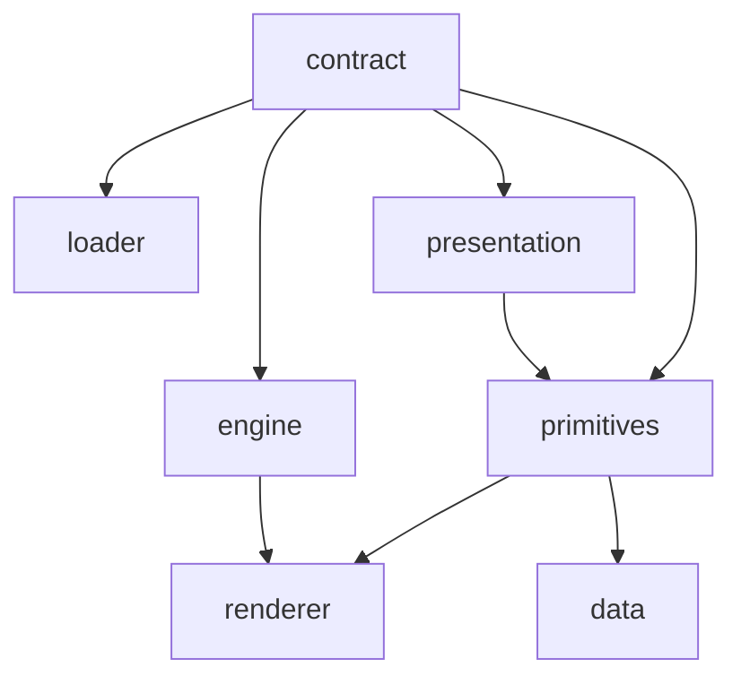
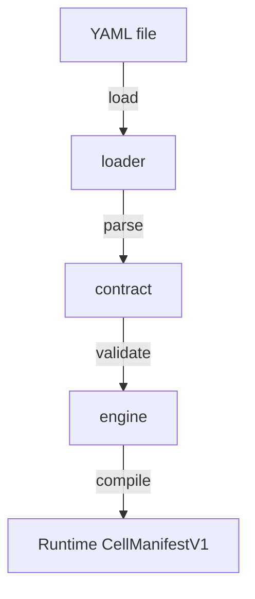

# Packages Overview

Packages are organized by responsibility.

## `libs/` core packages

These packages define the manifest contract, compile manifests, and render applications.

| Package | Role |
|---------|------|
| `@ikary/contract` | Zod schemas, TypeScript types, structural and semantic validation |
| `@ikary/loader` | YAML and JSON parsing, meta-property stripping, validation pipeline |
| `@ikary/engine` | Compilation, normalization, field derivation, path builders |
| `@ikary/presentation` | Zod schemas for UI primitive contracts |
| `@ikary/primitives` | React primitive components, resolvers, adapters, registry |
| `@ikary/data` | Data providers and entity data hooks |
| `@ikary/renderer` | Top-level `CellAppRenderer` and page rendering runtime |

See [Loading & Validation](/packages/loading) for the full contract pipeline API.

## `apps/` executable packages

These packages run as applications or CLIs.

| Package | Role |
|---------|------|
| `@ikary/cli` | `ikary` CLI for scaffolding, validation, compilation, local stack commands, and primitives tooling |
| `@ikary/ikary` | Thin npm wrapper that exposes the same `ikary` command |
| `@ikary/cell-runtime-api` | Local runtime REST API service generated from manifests |
| `@ikary/preview-server` | Local preview server used by the local stack |
| `@ikary/mcp-server` | Contract Intelligence API and MCP server |

## Dependency graph



## Processing pipeline



```typescript
import { loadManifestFromFile } from '@ikary/loader';
import { compileCellApp } from '@ikary/engine';

const loaded = await loadManifestFromFile('manifest.yaml');
if (loaded.valid) {
  const compiled = compileCellApp(loaded.manifest!);
}
```

## Build commands

```bash
pnpm build
pnpm test
pnpm typecheck
```
