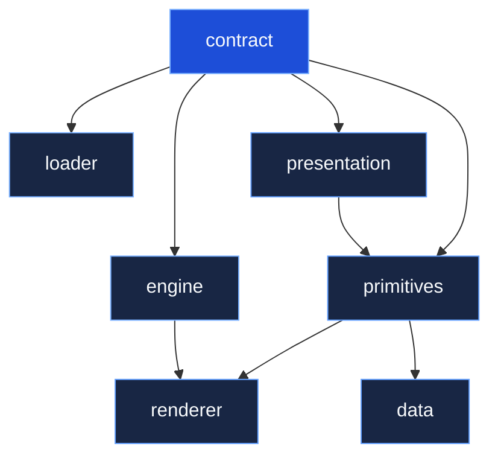
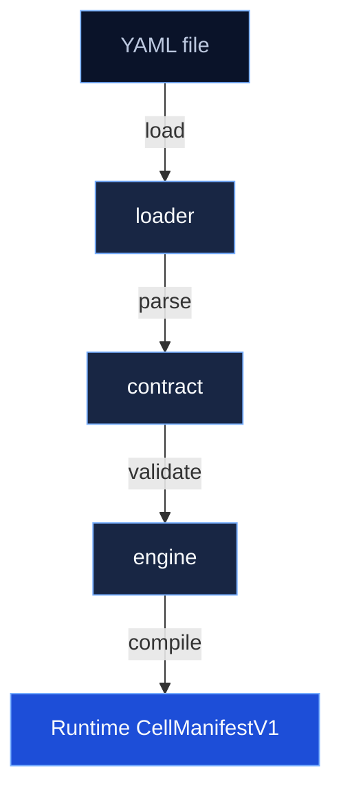

# Packages Overview

Packages are organised by concern, not by language. Each top-level directory answers a different question.

## contracts/

Everything related to "what is a valid manifest?".

| Package | Role |
|---------|------|
| `@ikary/contract` | Zod schemas, TypeScript types, structural + semantic validation |
| `@ikary/loader` | YAML/JSON parsing, meta-property stripping, validation pipeline |
| `@ikary/engine` | Compilation, normalization, field derivation, path builders |

See [Loading & Validation](/packages/loading) for the full API reference.

## runtime-api/

Everything related to "how do I serve a REST API from a manifest?".

| Package | Role |
|---------|------|
| `@ikary/generator-nest` | NestJS module/controller/service generator _(placeholder)_ |

## ui/

Client-side rendering. All packages target the browser, not Node.js.

| Package | Role |
|---------|------|
| `@ikary/presentation` | Zod schemas for 40+ UI primitive presentations |
| `@ikary/primitives` | React component library: primitives, registries, query engine |
| `@ikary/data` | Data-binding providers for entity pages |
| `@ikary/renderer` | Manifest-driven React app shell and page renderer |

## apps/

Standalone executables.

| App | Role |
|-----|------|
| `@ikary/cli` | `ikary` CLI: validate, compile, generate _(placeholder)_ |

## Dependency graph



## Processing pipeline

The three contract packages form a pipeline:



```typescript
import { loadManifestFromFile } from '@ikary/loader';
import { compileCellApp } from '@ikary/engine';

const loaded = await loadManifestFromFile('manifest.yaml');
if (loaded.valid) {
  const compiled = compileCellApp(loaded.manifest!);
}
```

## Building

```bash
pnpm build        # Build all packages (via Turbo)
pnpm test         # Run all tests
pnpm typecheck    # Type-check all packages
```
