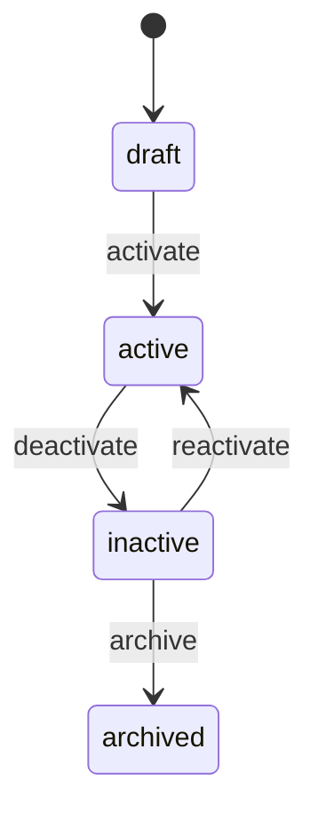

# Lifecycle & State Machine

A lifecycle defines the valid states a record can be in and the transitions between them. It is declared in the top-level `lifecycle` object on an entity definition.

## Structure

```yaml
lifecycle:
  field: status
  initial: draft
  states:
    - draft
    - active
    - inactive
    - archived
  transitions:
    - key: activate
      from: draft
      to: active
      label: Activate
      guards:
        - hasRequiredFields
    - key: deactivate
      from: active
      to: inactive
      label: Deactivate
      hooks:
        - notifyAccountManager
    - key: archive
      from: inactive
      to: archived
      label: Archive
      guards:
        - noOpenInvoices
```

| Field | Type | Description |
|-------|------|-------------|
| `field` | `string` | The entity field that stores the current state |
| `initial` | `string` | The state assigned when a record is created |
| `states` | `string[]` | All valid states |
| `transitions` | `Transition[]` | All valid state changes |

The `field` value must match an `enum` field defined in `fields`. The `enumValues` on that field should match the `states` array.

---

## Transitions

Each transition describes one valid state change.

| Field | Type | Description |
|-------|------|-------------|
| `key` | `string` | Unique transition identifier |
| `from` | `string` | Source state |
| `to` | `string` | Target state |
| `label` | `string` | Display label for the transition action |
| `guards` | `string[]?` | Guards that must pass before the transition runs |
| `hooks` | `string[]?` | Side effects to run after the transition succeeds |
| `event` | `string?` | Custom event name emitted when the transition runs |

---

## Guards

Guards prevent a transition from running unless all conditions pass. They are server-side checks — the keys are resolved by the backend and are not evaluated on the client.

```yaml
transitions:
  - key: archive
    from: inactive
    to: archived
    label: Archive
    guards:
      - noOpenInvoices
```

The runtime rejects the transition and returns an error if any guard fails. The frontend should disable or hide the transition action when the backend indicates it cannot proceed.

---

## Hooks

Hooks run side effects after a successful transition. Examples include sending notifications, creating related records, or triggering external workflows. They run server-side.

```yaml
transitions:
  - key: deactivate
    from: active
    to: inactive
    label: Deactivate
    hooks:
      - notifyAccountManager
```

Hook failures do not roll back the transition. Handle compensating actions in the hook implementation.

---

## State diagram

For the Customer entity example:



---

## Capabilities and lifecycle

Transitions integrate with capabilities. A capability of `type: 'transition'` exposes the transition as a UI action on the entity detail view.

```yaml
capabilities:
  - key: approve
    type: transition
    description: Approve and activate a draft customer record
    icon: check-circle
    scope: entity
    transition: activate
    confirm: true
```

Setting `confirm: true` shows a confirmation dialog before the transition runs.

---

## Lifecycle and validation

Lifecycle transitions are one of the three `serverValidators` types. A lifecycle validator checks whether a transition is permitted given server-side state — for example, whether a required external approval has been received. Declare it in `validation.serverValidators`:

```yaml
validation:
  serverValidators:
    - ruleId: customer.activation_requires_approval
      type: lifecycle
      messageKey: customer.activation_requires_approval
      clientSafe: false
      blocking: true
      severity: error
```

See [Field Validation Rules](./entity-validation) for the full `serverValidators` reference.
