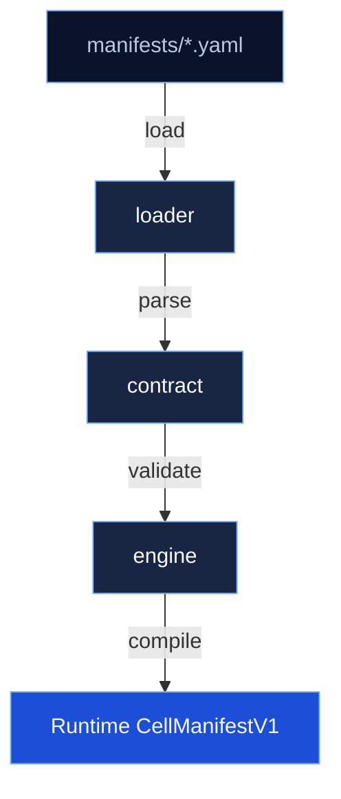
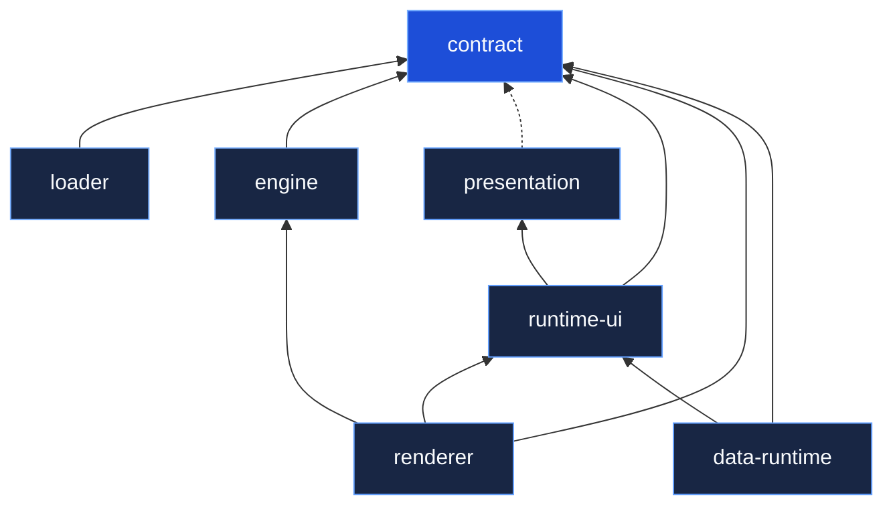

# Architecture

## Design Principles

1. **YAML is the source of truth** -- Manifests are authored in YAML under `manifests/`. TypeScript and Python runtimes consume these files.
2. **Language-neutral contracts** -- JSON Schema files in `manifests/schemas/` enable validation in any language without depending on TypeScript.
3. **Strong typing where it matters** -- TypeScript types are inferred from Zod schemas (`z.infer<typeof Schema>`), giving compile-time safety on the Node side without duplicating definitions.
4. **Separation of concerns** -- Loading (I/O), structural validation (Zod), semantic validation (business rules), and compilation (normalization + derivation) are distinct steps in distinct packages.

## Processing Pipeline



### Step by step

1. **Load**: `@ikary-manifest/loader` reads a `.yaml` or `.json` file, parses it into a plain JS object. No validation yet.
2. **Structural validation**: `@ikary-manifest/contract`'s `parseManifest()` runs `CellManifestV1Schema.safeParse()`. This catches type mismatches, missing required fields, invalid enum values, etc. The result is a typed `CellManifestV1` object.
3. **Semantic validation**: `validateManifestSemantics()` checks business rules that Zod can't express: unique entity keys, valid lifecycle transitions, relation consistency, page-entity bindings, navigation references, etc.
4. **Compilation**: `@ikary-manifest/engine`'s `compileCellApp()` normalizes the manifest (ensures arrays exist), derives form fields, builds scope registries, and returns a runtime-ready manifest.

### Why separate loader from contract?

- **Contract stays pure** -- no filesystem access, no YAML dependency. It's a validation library.
- **Loader owns I/O** -- file reading, YAML/JSON parsing, format detection.
- **Consumers compose** -- a CLI loads from files; a web API validates in-memory objects. Both use contract, but only the CLI needs loader.

## Compile-time vs Runtime

| Concern | When | Where |
|---------|------|-------|
| TypeScript types | Compile-time | `z.infer<typeof Schema>` in contract |
| Zod structural validation | Runtime | `CellManifestV1Schema.safeParse()` |
| Semantic business rules | Runtime | `validateManifestSemantics()` |
| Field derivation | Runtime | `deriveCreateFields()`, `deriveEditFields()` |
| JSON Schema validation | Runtime | Any language using `manifests/schemas/` |

YAML files cannot create compile-time TypeScript types. The types are defined by Zod schemas in the contract package. YAML manifests are validated against those schemas at runtime.

## Why Python Uses Shared Artifacts

Python does not and should not depend on TypeScript files. Instead:

- **YAML manifests** -- same files, parsed with PyYAML
- **JSON Schema** -- generated from Zod schemas via `pnpm -w run generate:schema`, used with `jsonschema` for structural validation
- **Semantic rules** -- will be implemented natively in Python when needed

This gives Python full access to the manifest ecosystem without a Node.js build step at runtime.

## Package Dependency Graph



## JSON Schema Generation

JSON Schemas are generated from Zod schemas, not hand-written:

```bash
pnpm -w run generate:schema
```

This produces `manifests/schemas/CellManifestV1.schema.json` and `manifests/schemas/EntityDefinition.schema.json`.

Limitations:
- Recursive types (nested navigation items, nested fields) default to `any` in JSON Schema
- `superRefine` validators (uniqueness checks, cross-entity references) don't translate -- these are semantic rules
- The JSON Schema covers structural validation only
