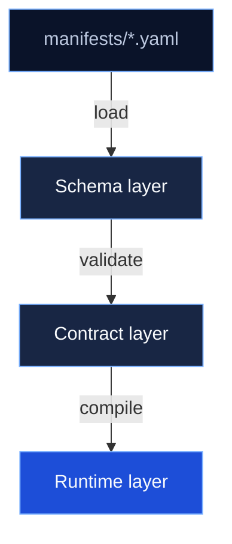
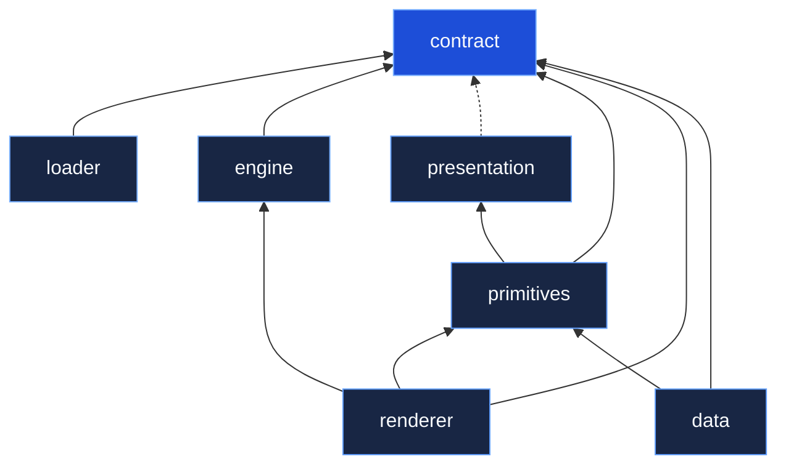

# Architecture

## Three layers

IKARY Manifest separates concerns into three distinct layers. Each layer has one job and does not depend on implementation details from the others.

### Schema layer

The schema layer is language-neutral YAML manifests and JSON Schema definitions stored in the `manifests/` directory. No runtime code lives here. Any tool that can parse YAML can read these files. Any language that supports JSON Schema can validate against them.

### Contract layer

The contract layer consists of language-specific packages that load, parse, and validate manifests. TypeScript uses `@ikary/contract` with Zod-based validation. Python uses `ikary_manifest` with JSON Schema structural validation and native semantic rules.

The contract layer owns all validation: structural checks (types, required fields, pattern matching) and semantic checks (unique keys, valid cross-references, lifecycle consistency). It produces a typed, validated manifest ready for compilation.

### Runtime layer

The runtime layer consumes a validated, compiled manifest and produces running software. It has two parts:

- **API runtime**: generates REST API endpoints from entity definitions. NestJS for Node.js, FastAPI for Python.
- **UI runtime**: renders a web application from page and entity definitions. React is the current renderer; Vue.js is next.

The runtime layer works with the typed output of the contract layer. It has no direct dependency on raw YAML or schema files.

## Processing pipeline



### Step by step

1. **Load**: `@ikary/loader` reads a `.yaml` or `.json` file and parses it into a plain JS object. No validation yet.
2. **Structural validation**: `@ikary/contract`'s `parseManifest()` runs Zod's `safeParse`. This catches type mismatches, missing required fields, and invalid enum values. The result is a typed `CellManifestV1` object.
3. **Semantic validation**: `validateManifestSemantics()` checks business rules that Zod cannot express: unique entity keys, valid lifecycle transitions, relation consistency, page-entity bindings, and navigation references.
4. **Compilation**: `@ikary/engine`'s `compileCellApp()` normalizes the manifest, derives form fields, builds scope registries, and returns a runtime-ready manifest.

### Why loader and contract are separate

The contract package has no filesystem access and no YAML dependency. It is a pure validation library. The loader owns I/O: file reading, YAML parsing, and format detection. A CLI needs both. A web API that receives JSON in a request body needs only contract. Both compositions work because the layers are independent.

## Compile-time vs runtime

| Concern | When | Where |
|---------|------|-------|
| TypeScript types | Compile-time | `z.infer<typeof Schema>` in contract |
| Zod structural validation | Runtime | `CellManifestV1Schema.safeParse()` |
| Semantic business rules | Runtime | `validateManifestSemantics()` |
| Field derivation | Runtime | `deriveCreateFields()`, `deriveEditFields()` |
| JSON Schema validation | Runtime | Any language using `manifests/` schemas |

YAML files cannot create compile-time TypeScript types. The types are defined by Zod schemas in the contract package. YAML manifests are validated against those schemas at runtime.

## Package dependency graph



## JSON Schema generation

JSON Schemas are generated from Zod schemas, not written by hand:

```bash
pnpm -w run generate:schema
```

This produces `node/dist/schemas/CellManifestV1.schema.json` and `node/dist/schemas/EntityDefinition.schema.json`.

Limitations:
- Recursive types (nested navigation items, nested fields) default to `any` in JSON Schema
- `superRefine` validators (uniqueness checks, cross-entity references) do not translate to JSON Schema; they are enforced as semantic rules in the contract layer
- The generated JSON Schema covers structural validation only
