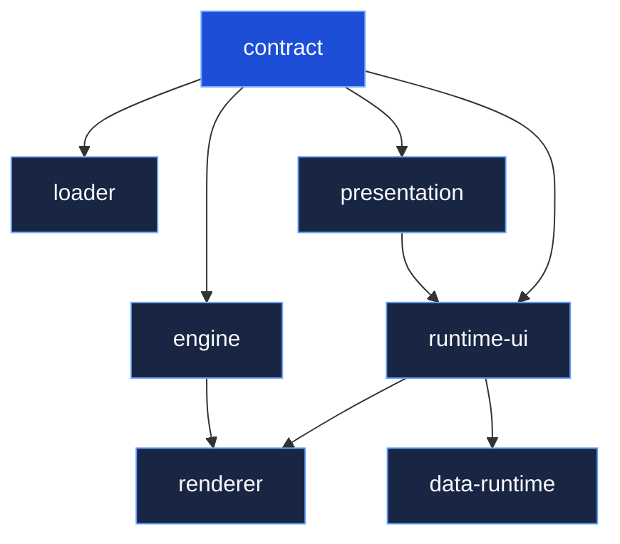
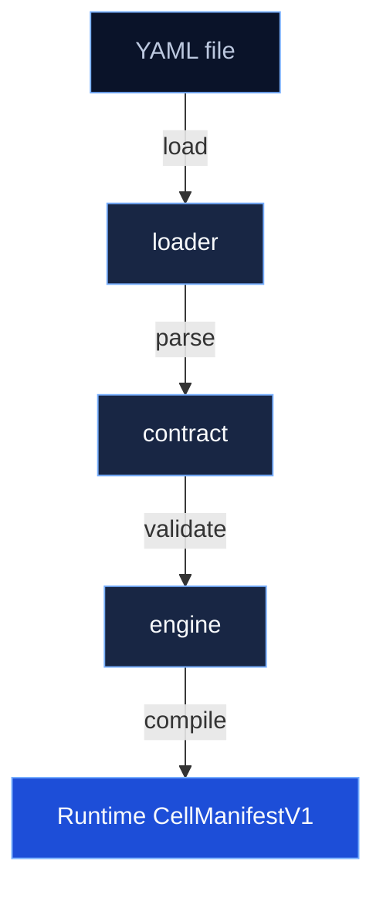

# Packages Overview

The Node.js side of IKARY Manifest is organized as a pnpm monorepo under `node/packages/`.

## Package map

| Package | Role |
|---------|------|
| [`@ikary-manifest/contract`](/packages/contract) | Zod schemas, TypeScript types, structural + semantic validation |
| [`@ikary-manifest/loader`](/packages/loader) | YAML/JSON parsing, meta-property stripping, validation pipeline |
| [`@ikary-manifest/engine`](/packages/engine) | Compilation, normalization, field derivation, path builders |
| `@ikary-manifest/presentation` | Presentation-layer schemas for 40+ UI primitives |
| `@ikary-manifest/runtime-ui` | React component library: primitives, registries, query engine |
| `@ikary-manifest/renderer` | Manifest-driven React renderer |
| `@ikary-manifest/data-runtime` | Data-binding providers for entity pages |
| `@ikary-manifest/cli` | Developer CLI _(placeholder)_ |
| `@ikary-manifest/generator-nest` | NestJS code generator _(placeholder)_ |

## Dependency graph



## Processing pipeline

The three core packages form a pipeline:



Consumers compose these steps:

```typescript
import { loadManifestFromFile } from '@ikary-manifest/loader';
import { compileCellApp } from '@ikary-manifest/engine';

const loaded = await loadManifestFromFile('manifest.yaml');
if (loaded.valid) {
  const compiled = compileCellApp(loaded.manifest!);
}
```

## Building

```bash
pnpm build        # Build all packages (via Turbo)
pnpm test         # Run all tests
pnpm typecheck    # Type-check all packages
```
