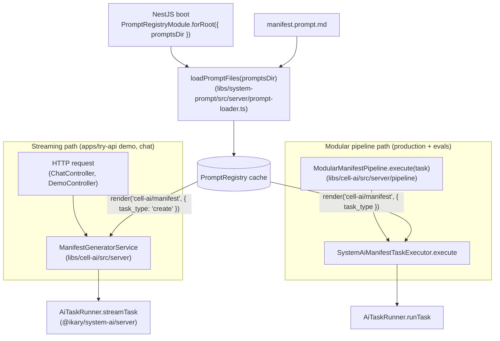

# /prompts/cell-ai

Prompts consumed by `@ikary/cell-ai`. One prompt drives every manifest generation, fix, and update flow across both the streaming production path (`apps/try-api`) and the modular pipeline used by `evals/`.

## Files

| File | Purpose | Arguments |
|---|---|---|
| [`manifest.prompt.md`](./manifest.prompt.md) | Single system prompt for CREATE / FIX / UPDATE. Schema constraints, naming rules, navigation rules, and a worked CellManifestV1 example, with three Handlebars variants selected by `task_type`. | `task_type` (system, required) |

Per-pipeline differences (retrieval, clarification, framing) live in the user-message context assembled by each pipeline. The system prompt stays the same.

## Orchestration



## Notes

`task_type` is declared `source: system` because it comes from the closed `'create' | 'fix' | 'update'` enum. The three Handlebars conditionals select the matching rule block:

```handlebars
{{#if (eq task_type "create")}}CREATE RULES: ...{{/if}}
{{#if (eq task_type "fix")}}FIX RULES: ...{{/if}}
{{#if (eq task_type "update")}}UPDATE RULES: ...{{/if}}
```

The shared preamble (output rules, schema constraints, naming rules, navigation rules, reference example) sits above the conditionals, so the three variants cannot drift apart.
