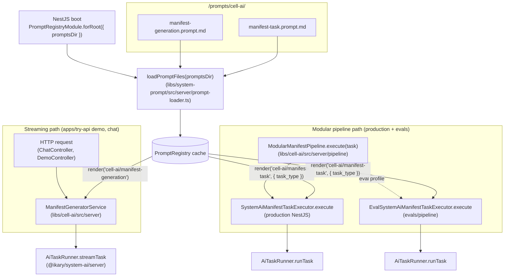

# /prompts/cell-ai

Prompts consumed by `@ikary/cell-ai`. They drive the two manifest-generation flows on the production server (`apps/try-api`) and inside the modular pipeline used by `evals/`.

## Files

| File | Purpose | Arguments |
|---|---|---|
| [`manifest-generation.prompt.md`](./manifest-generation.prompt.md) | System prompt for the streaming manifest generation flow. The 95-line CellManifestV1 contract and worked example. | none |
| [`manifest-task.prompt.md`](./manifest-task.prompt.md) | System prompt for the modular pipeline. Selects CREATE / FIX / UPDATE rules from `task_type`. | `task_type` (system, required) |

## Orchestration



## Notes per prompt

### `manifest-generation.prompt.md`

Fixed system prompt with no template variables. `arguments: []`. Used as the system message of `AiTaskRunner.streamTask` so the model streams a single CellManifestV1 JSON object back. The body includes the canonical schema rules, naming rules, navigation rules, and a worked example.

### `manifest-task.prompt.md`

One file with three Handlebars conditional blocks. `task_type` (declared `source: system` because it comes from the closed `'create' | 'fix' | 'update'` enum) selects which block to emit:

```handlebars
{{#if (eq task_type "create")}}CREATE RULES: ...{{/if}}
{{#if (eq task_type "fix")}}FIX RULES: ...{{/if}}
{{#if (eq task_type "update")}}UPDATE RULES: ...{{/if}}
```

The shared preamble (`OUTPUT RULES`) lives at the top, outside the conditionals, so the three variants cannot drift apart. This replaced a switch-based string-builder in `pipeline/task-prompts.ts` that concatenated a `common` constant with one of three per-type tails.

## Verification

The migration preserved the rendered text byte-for-byte against the deleted TS constants. Both prompts are exercised in the regular pipeline tests; the registry itself is covered to 100% in `libs/system-prompt`.
