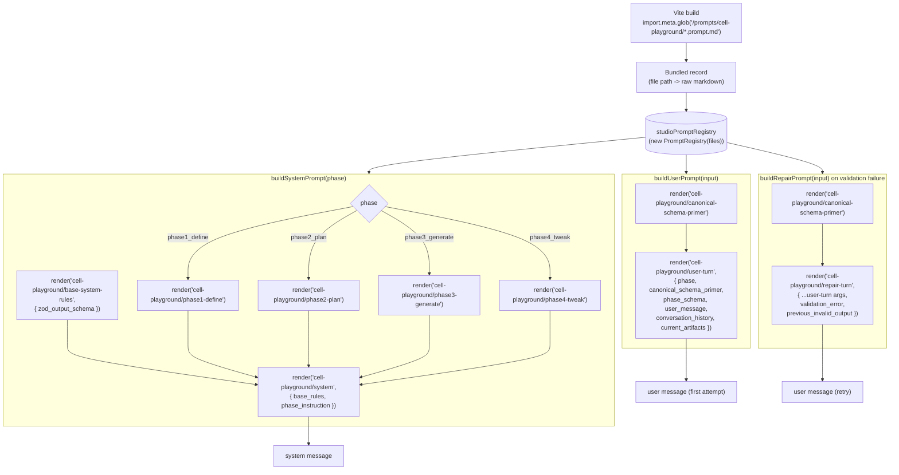

# /prompts/cell-playground

Prompts consumed by `apps/cell-playground-legacy`. The legacy Studio runs four sequential phases (`phase1_define`, `phase2_plan`, `phase3_generate`, `phase4_tweak`), and on each turn the model gets a system message, a user message, and (on validation failure) a corrective repair message.

## Files

| File | Role | Arguments |
|---|---|---|
| [`base-system-rules.prompt.md`](./base-system-rules.prompt.md) | Global guardrails. Same in every phase. Receives the phase Zod schema. | `zod_output_schema` (system, required) |
| [`phase1-define.prompt.md`](./phase1-define.prompt.md) | Phase 1 discovery instruction. | none |
| [`phase2-plan.prompt.md`](./phase2-plan.prompt.md) | Phase 2 planning instruction. | none |
| [`phase3-generate.prompt.md`](./phase3-generate.prompt.md) | Phase 3 initial-generation instruction. | none |
| [`phase4-tweak.prompt.md`](./phase4-tweak.prompt.md) | Phase 4 tweak (patch-first) instruction. | none |
| [`system.prompt.md`](./system.prompt.md) | Envelope. Composes `base_rules` and `phase_instruction` into the final system message. | `base_rules`, `phase_instruction` (both system, required) |
| [`canonical-schema-primer.prompt.md`](./canonical-schema-primer.prompt.md) | Compact CellManifestV1 contract reminder. Inlined into user and repair turns. | none |
| [`user-turn.prompt.md`](./user-turn.prompt.md) | First-attempt user turn. Bundles primer, phase schema, latest message, history, artifacts. | `phase`, `canonical_schema_primer`, `phase_schema`, `user_message` (user), `conversation_history`, `current_artifacts` |
| [`repair-turn.prompt.md`](./repair-turn.prompt.md) | Corrective retry. Adds the validation error and the previous invalid payload. | `user-turn` arguments plus `validation_error`, `previous_invalid_output` |

## Orchestration

## How a turn flows

1. The Studio chooses a `phase` based on the conversation state.
2. `buildSystemPrompt(phase)` composes the system message: base rules with the phase Zod schema, plus the per-phase instruction.
3. `buildUserPrompt(...)` builds the first user message, embedding the canonical schema primer, the phase schema, the latest user message, recent history, and the current artifact snapshot.
4. The model returns a payload. If validation against the phase Zod schema fails, `buildRepairPrompt(...)` builds a retry message that adds the validation error and the failed payload.

The composition lives in `apps/cell-playground-legacy/src/features/studio/phase-prompts.ts`. The browser-side registry singleton lives in `apps/cell-playground-legacy/src/features/studio/prompts/registry.ts`.

## User-supplied input

Only `user_message` is declared `source: user`. The browser-side `PromptRegistry` skips sanitization (the playground is a developer surface, not a public-input one), so the `source: user` mark is currently informational. If the same prompts ever run server-side, the registry will run `InputSizeGuard` and `PromptSanitizer` on `user_message` automatically.

## Adding a new phase

1. Add a prompt at `prompts/cell-playground/phaseN-<label>.prompt.md`.
2. Extend the `StudioPhase` union and `phaseInstructionPromptName(phase)` switch in `phase-prompts.ts`.
3. Add the phase Zod schema in `phase-schemas.ts` so `responseZodJsonSchemaForPhase` returns it.
