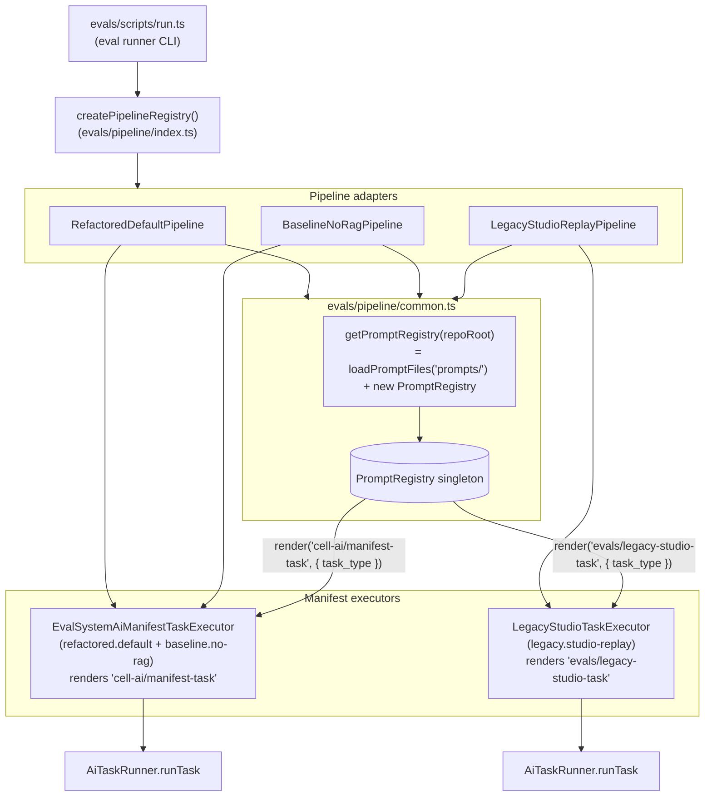

# /prompts/evals

Prompts consumed by the eval harness in `evals/`. Currently one file: the legacy-studio replay system prompt.

## Files

| File | Purpose | Arguments |
|---|---|---|
| [`legacy-studio-task.prompt.md`](./legacy-studio-task.prompt.md) | System prompt for the `legacy.studio-replay` eval pipeline. Selects discovery / repair / tweak guidance from `task_type`. | `task_type` (system, required) |

## Orchestration

## Notes

The eval harness shares the same `/prompts` tree as production. Two adapters (`refactored.default`, `baseline.no-rag`) reuse the production prompt `cell-ai/manifest-task`, so changes there immediately affect both production manifest generation and these eval runs. The `legacy.studio-replay` adapter renders `evals/legacy-studio-task` (lives in this folder), kept separate so its discovery / repair / tweak voicing does not pollute the production prompt.

`getPromptRegistry(repoRoot)` builds the registry once per process and caches it. Sanitization runs through the same hook as production: any `source: user` argument is size-guarded and passed through `PromptSanitizer` from `@ikary/system-ai`.

## Adding a new eval-only prompt

1. Add a `*.prompt.md` file under `prompts/evals/`.
2. Render it from your executor with `registry.render('evals/<id>', args, { taskName: 'evals/<id>' })`.
3. Construct the executor in `evals/pipeline/common.ts` so it receives the cached `PromptRegistry`.
