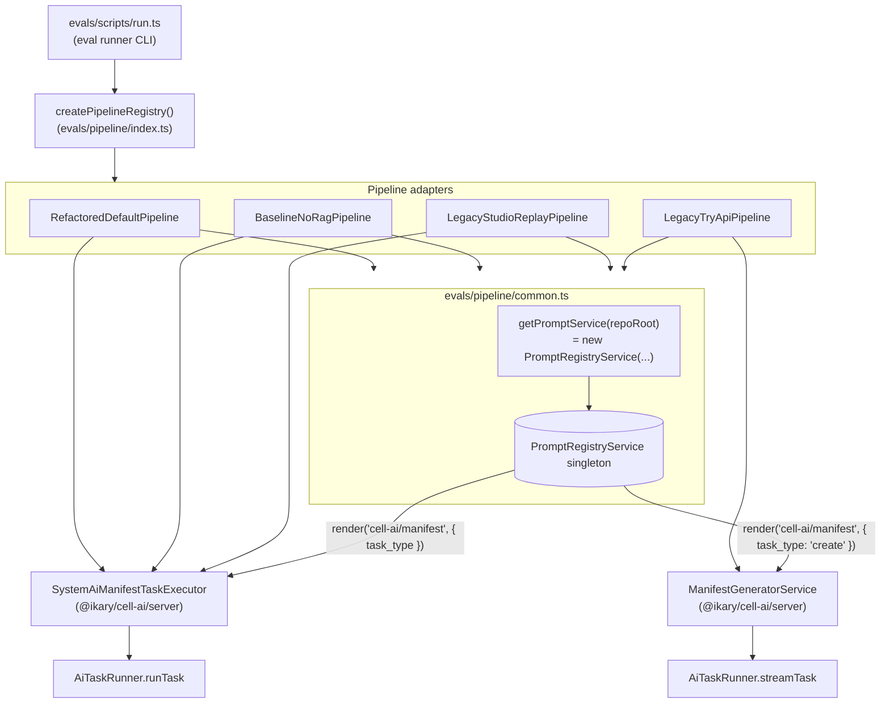

# /prompts/evals

Holding folder for eval-only prompts. Currently empty. Every eval pipeline now renders the production prompt `cell-ai/manifest`.

## How eval pipelines reach the prompt

## Why eval pipelines now share one prompt

Earlier each pipeline had its own prompt and executor. Differences in retrieval, clarification framing, and user-message shape were entangled with the system prompt, which made schema fixes have to land in three places.

The current layout pushes all per-pipeline differences into the `ContextAssembler` of each pipeline. The system prompt, the executor, and the rotation chain stay identical across pipelines.

## Adding a new eval-only prompt

Only add a file here when an eval needs guidance the production prompt should not carry. Most cases are better solved by adjusting the pipeline's `ContextAssembler` to inject the framing into the user message.

1. Add a `*.prompt.md` file under `prompts/evals/`.
2. Render it from your executor with `service.render('evals/<id>', args, { taskName: 'evals/<id>' })`.
3. Wire the executor in `evals/pipeline/common.ts` so it receives the cached `PromptRegistryService`.
